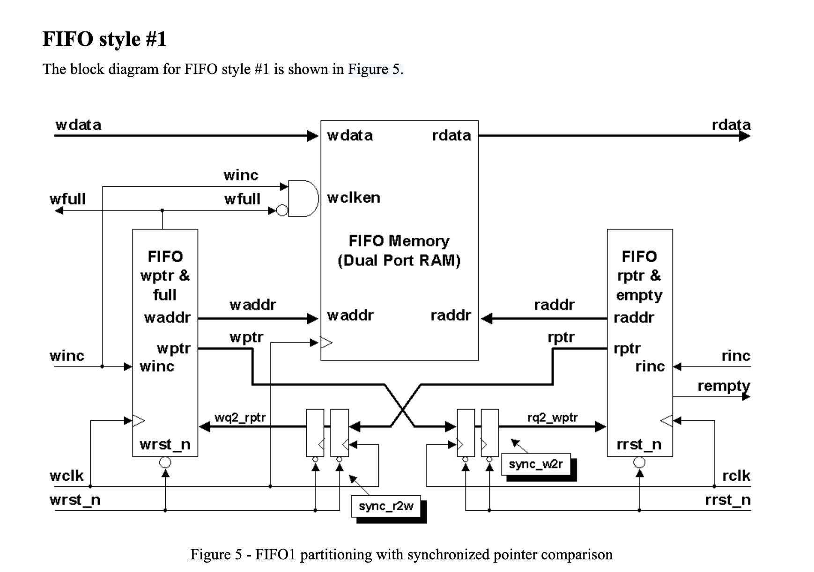
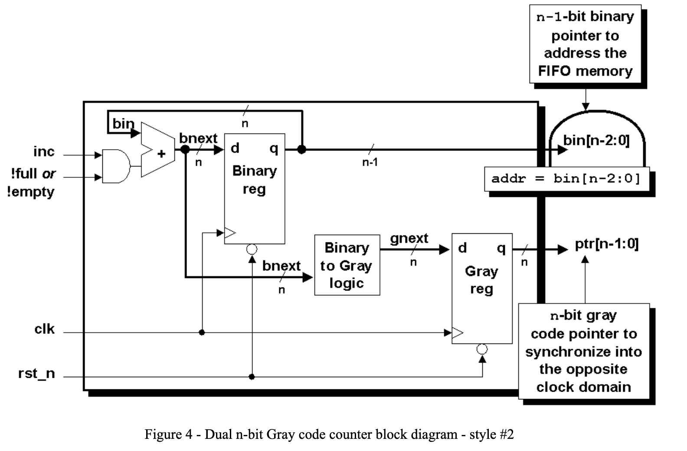

# Asynchronous FIFO with Synchronized Gray Pointers

### Some key notes
- Based on Clifford Cummings' [paper](https://scholar.google.com/citations?view_op=view_citation&hl=en&user=j53P4MQAAAAJ&citation_for_view=j53P4MQAAAAJ:3fE2CSJIrl8C) 
- Involves clock domain crossing, where read and write clocks have different frequencies
- Uses gray code for pointers and a 2-flop synchronizer to ensure that the transmitted pointer value is either the old value (which may happen due to metastability) or the new one
- Pessimistic flags which are asserted immediately when the FIFO becomes empty/full but deassert late as synchronized pointers lag their actual values
- Pointers are n+1 bits wide to distinguish full from empty
- Full is computed in the write domain, empty in the read domain
- write_en and read_en are assumed synchronous to their own clocks


### Build Instructions 
Requirements: Verilator 5.052, a C++ compiler, bash  

```bash
chmod +x ./run.sh
./run.sh
```
This compiles once and runs the same binary with different clock periods and seeds which are configurable in the run.sh file.  
Waveform is written to async_fifo.vcd (open with surfer or GTKWave).


### Test Methodology
- Individual modules were tested for basic functionality, individual test benches are in /tb
- async_fifo_tb and run.sh involve different clock periods (coprime, multiples) and run till (1000 * DEPTH) write attempts are done
- At each write and read clock posedge, there is a 70% chance we attempt a write and read respectively, done to simulate randomness
- A queue checks data order and content on every accepted read
- A counter was used to check that reads never exceed writes


### Architecture
FIFO architecture followed the paper's design but with merged resets and a look-ahead read address.


Gray Code Counter architecture


Both pictures are taken from Clifford Cummings' [paper](https://scholar.google.com/citations?view_op=view_citation&hl=en&user=j53P4MQAAAAJ&citation_for_view=j53P4MQAAAAJ:3fE2CSJIrl8C).


### Debugging Issues
While testing async_fifo, the values of read_data did not match up with the values at the front of the queue. Initially, I had thought that it was an issue of timing with the #1 delay in the checking block.  
After fixing that, I realised read_data was giving me old values on read attempts that happen on two consecutive clock edges.  
It turned out in dual_port_ram, I had implemented read_data with sequential logic. To continue using sequential logic, I implemented look-ahead assigning read_data to ram[next_read_address] instead of ram[read_address]. A combinational logic solution is not viable as FPGA block RAM has a registered read.

Consequently, this means that the path for read_en is relatively long:
- & with ~empty
- adder with carry with current_bin
- next_read_address
- input to dual_port_ram

For applications with higher FIFO depth, pipelining can be used to meet timing by adding a flag addressing the RAM from the pointer. This costs one cycle of read latency but does not reduce throughput.


### Future Work
- almost_full and almost_empty flags
- Formal hardware verification, e.g. using SymbiYosys
- Separate resets for both clocks